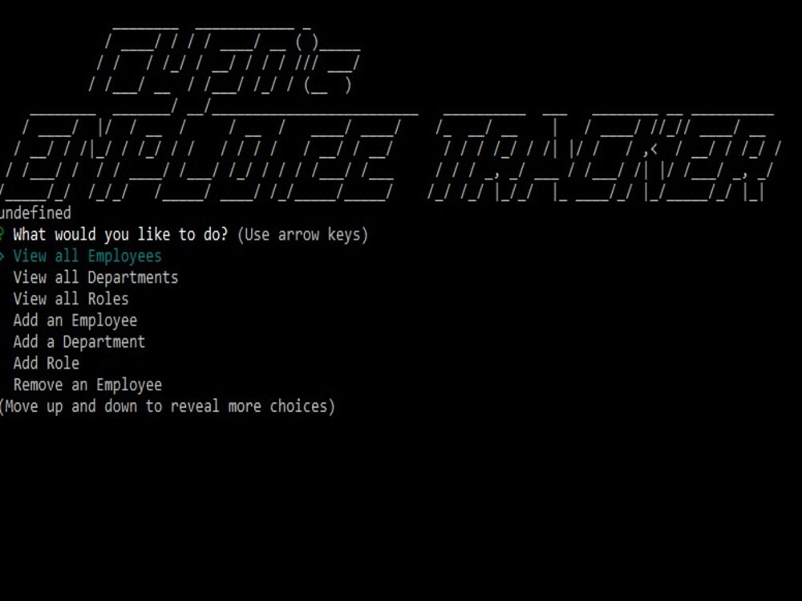

# Employee Tracker MySQL&middot;  

## Description 
Employee Track is a command line application where users can manage the departments, roles and employees of a store. It uses a MySQL database to store data entries for the departments, roles and Employees, this project used our skills in MySQL and Node to write functions that would query our database for us with our input.

## Table of Contents 
* [Installation](#Installation)
* [Usage](#Usage)
* [License](#License)
* [Contributions](#Contributions)
* [Tests and Examples](#Tests)
* [Questions](#Questions)

## Installation  
Since this is a simple command line application, it is easiest to download this repo, and with node installed on your machine, you enter into your shell "node index.js" while in the right working Directory

## Usage  
This Application is intended to be Used as a tool for someone of a management position in a store to allocate employees to their appropriate roles within departments indicate who is someone's supervisor

## License  
Academic Free License v3.0

[Click Here to go to License Site!](https://opensource.org/licenses/AFL-3.0)

## Questions  
If there are any questions feel free to reach me at [Github](https://github.com/ChrisAMK)

or E-mail me at chriskl@live.com

